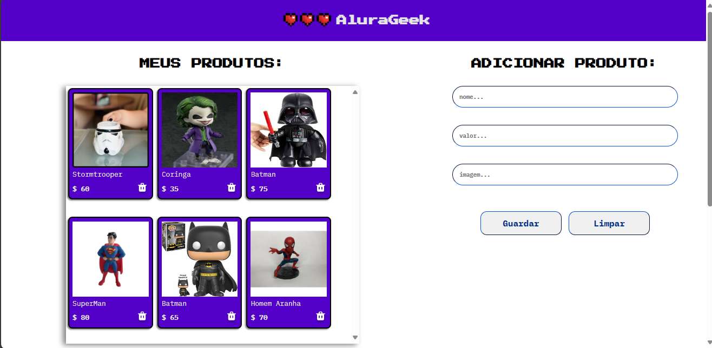

# AluraGeek

## Sobre o Projeto

O AluraGeek é um ecommerce temático de games, desenvolvido para aplicar conhecimentos sobre CRUD (Create, Read, Update, Delete). Utilizamos uma API externa para buscar as informações dos produtos e criar novos produtos, funcionando como um "banco de dados" pronto para acessar as informações necessárias. Este projeto visa demonstrar minhas capacidades técnicas em desenvolvimento web, especificamente na criação e manipulação de dados de produtos.

## Tecnologias Utilizadas

- **HTML**
- **CSS**
- **JavaScript**

## Funcionalidades

- **Adicionar Produto:** Formulário para inserção de novos produtos com nome, valor e imagem.
- **Listar Produtos:** Exibição dos produtos cadastrados em cards na interface.
- **Deletar Produto:** Funcionalidade para remover produtos da lista.

## Aprendizados

Durante o desenvolvimento deste projeto, pude aprender e aplicar os seguintes conceitos:

- Estruturação de um site completo utilizando HTML e CSS.
- Implementação de interatividade com JavaScript.
- Integração com uma API externa para manipulação de dados de produtos.
- Criação de um layout responsivo que se adapta a diferentes tamanhos de tela.
- Uso de JavaScript para manipulação do DOM e validação de campos de formulário.

## Como Usar

1. Abra o arquivo `index.html` no seu navegador preferido.
2. Explore a lista de produtos exibidos na página inicial.
3. Utilize o formulário de adicionar produto para inserir novos itens.
4. Clique no botão de deletar para remover produtos da lista.

## Link para o Projeto

- [AluraGeek - Acesse o projeto](https://challenge-alura-geek-silk.vercel.app/)

## Tecnologias

  
  
  

## Contato

Aldemir Junior - [LinkedIn](https://www.linkedin.com/in/aldemir-desenvolvedor/) - [aldemirjuniorg@gmail.com](mailto:aldemirjuniorg@gmail.com)
